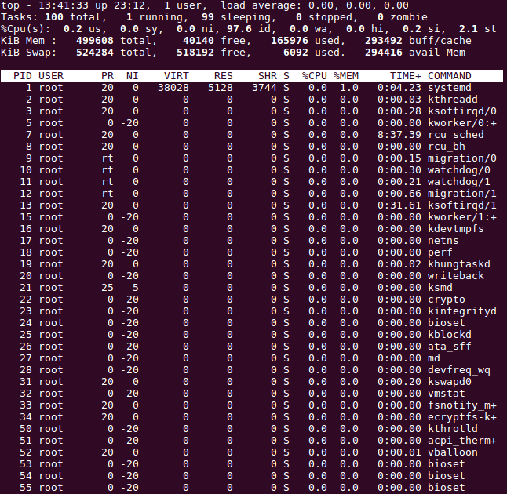
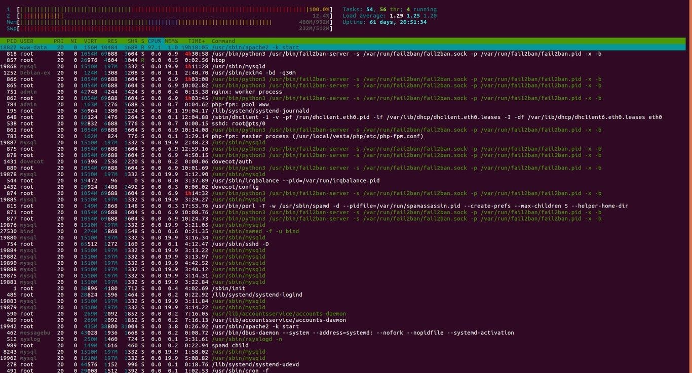
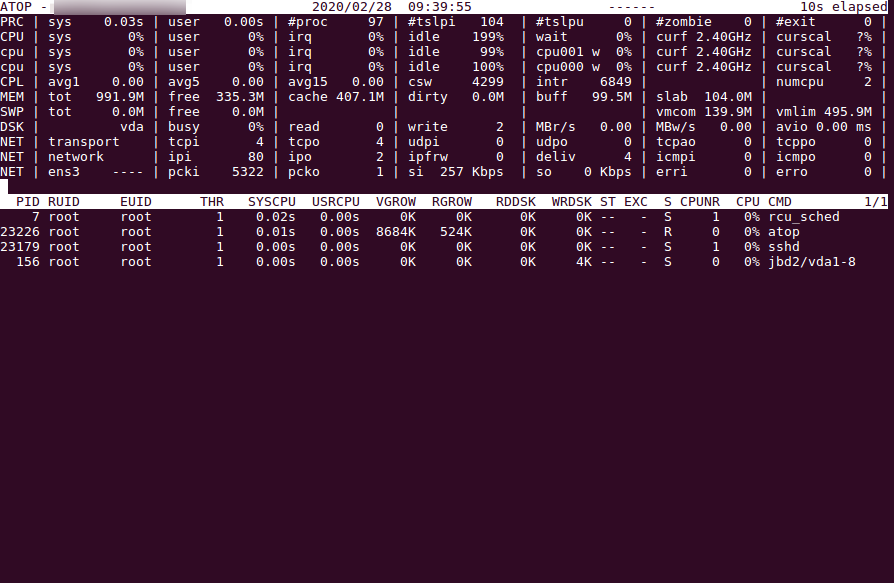
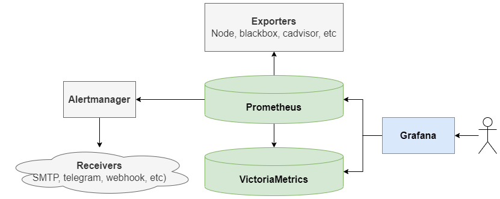
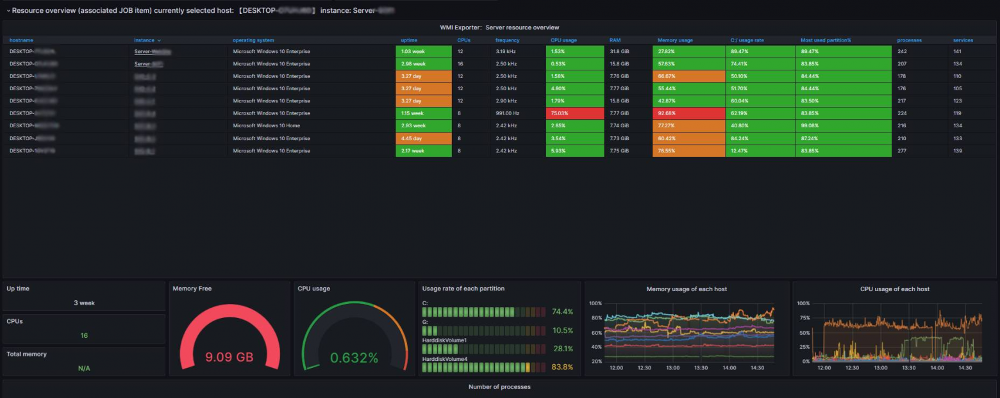

# Реферат
«Мониторинг производительности ИТ-инфраструктуры: использование atop, htop и современных систем (Prometheus, Grafana)»
по дисциплине «Администрирование информационных систем»

## ОГЛАВЛЕНИЕ
[ВВЕДЕНИЕ](#введение)

[1. Теоретические основы мониторинга производительности ИТ-инфраструктуры](#1-теоретические-основы-мониторинга-производительности-ит-инфраструктуры)

[2. Консольные утилиты для оперативного анализа: atop и htop](#2-консольные-утилиты-для-оперативного-анализа-atop-и-htop)

[3. Современные системы распределенного мониторинга: Prometheus и Grafana](#3-современные-системы-распределенного-мониторинга-prometheus-и-grafana)

[4. Сравнительный анализ инструментов и сферы их применения](#4-сравнительный-анализ-инструментов-и-сферы-их-применения)

[ЗАКЛЮЧЕНИЕ](#заключение)

[СПИСОК ЛИТЕРАТУРЫ](#список-литературы)

## ВВЕДЕНИЕ

В условиях цифровой трансформации стабильность и высокая производительность информационных систем (ИС) становятся критически важными факторами для успеха любого бизнеса. ИТ-инфраструктура, лежащая в основе этих систем, представляет собой сложный комплекс серверов, сетевого оборудования, систем хранения данных и приложений. Сбои или деградация ее производительности приводят к простоям, финансовым потерям и ущербу репутации. В связи с этим, эффективный мониторинг производительности перестает быть вспомогательной задачей и превращается в обязательную, непрерывную практику системного администратора. [3]

**Цель реферата** – изучить подходы и инструменты для мониторинга производительности ИТ-инфраструктуры, сфокусировавшись на классических консольных утилитах (`atop`, `htop`) и современных комплексных системах (Prometheus, Grafana).

**Задачи работы:**
*   Раскрыть теоретические основы, цели и ключевые метрики мониторинга производительности.
*   Исследовать возможности консольных утилит `atop` и `htop` для оперативного анализа состояния системы.
*   Изучить архитектуру и принципы работы современных систем мониторинга на примере связки Prometheus и Grafana.
*   Провести сравнительный анализ рассмотренных инструментов, определить их оптимальные сферы применения в работе администратора информационных систем.

**Объект исследования:** инструменты и методики мониторинга производительности ИТ-инфраструктуры.
**Предмет исследования:** функциональные возможности и особенности применения утилит `atop`, `htop`, а также систем Prometheus и Grafana.

## 1. Теоретические основы мониторинга производительности ИТ-инфраструктуры

В контексте администрирования информационных систем мониторинг производительности представляет собой непрерывный процесс измерения, сбора, анализа и визуализации ключевых показателей работы компонентов ИТ-инфраструктуры. [3]

Фундаментальной целью мониторинга является преобразование сырых данных о работе системы (метрик) в ценную информацию для принятия оперативных и стратегических решений. Эта общая цель реализуется через ряд конкретных задач:
1.  Выявление аномалий и негативных трендов (например, рост загрузки процессора или постепенное заполнение диска) до того, как они приведут к отказу сервиса, что позволяет устранить их в плановом порядке.
2.  При возникновении сбоя (например, падение производительности приложения) мониторинг предоставляет точные данные о состоянии системы на момент проблемы, что значительно сокращает время на поиск корневой причины.
3.  Исторические данные о потреблении ресурсов (процессорного времени, оперативной памяти, дискового пространства, сетевого трафика) позволяют прогнозировать будущие потребности, обосновывать необходимость модернизации оборудования или масштабирования сервисов.
4.  После внесения изменений в конфигурацию, обновления программного обеспечения или развертывания нового приложения мониторинг позволяет объективно оценить их влияние на производительность и стабильность инфраструктуры.
5.  Постоянное измерение таких метрик, как время отклика и доступность, предоставляет доказательства выполнения или нарушения обязательств перед пользователями.

Базовым принципом эффективного мониторинга является измерение правильных метрик. Наиболее информативными, дающими комплексное представление о здоровье отдельного сервера или виртуальной машины, являются показатели четырех ключевых подсистем. [3]

Загрузка процессора — первичный индикатор вычислительной нагрузки. Важно анализировать не только общую загрузку (`%CPU`), но и ее структуру: процент времени, затраченного на выполнение пользовательских процессов (`%user`), обработку системных вызовов (`%system`), ожидание операций ввода-вывода (`%iowait`) и обработку прерываний. Высокий `%iowait` или `%system` может указывать на проблемы с другими подсистемами.

Мониторинг оперативной памяти должен выходить за рамки простого отслеживания свободной памяти. В современных Linux-системах, активно использующих кэш и буферы, ключевым показателем становится **доступная память**, которая учитывает память, которую можно быстро освободить. Критически важными метриками являются использование подкачки, что сигнализирует о нехватке физической RAM, а также активность страничного обмена (`page in`/`page out`), которая напрямую влияет на производительность. [6]

Производительность хранилища часто является узким местом. Основные измеряемые параметры:
*   **Утилизация (`%util`):** процент времени, когда устройство было занято обработкой запросов.
*   **Пропускная способность (`read/write MB/s`):** объем данных, переданных в секунду.
*   **Время отклика (`await`):** среднее время (в миллисекундах), которое запрос проводит в очереди и обрабатывается.
*   **Частота операций ввода-вывода (`IOPS`):** количество операций чтения/записи в секунду.

Высокие значения `await` при значительной утилизации указывают на перегрузку диска или неоптимальную конфигурацию RAID-массива.

Мониторинг сети включает отслеживание объема переданного и принятого трафика (`rx_bytes/s`, `tx_bytes/s`) для выявления перегрузок канала, а также количества ошибок и коллизий на интерфейсах, которые могут свидетельствовать о физических или конфигурационных проблемах.

Современный подход заключается в мониторинге не только этих базовых метрик, но и **метрик бизнес-уровня**, таких как время отклика приложения или количество успешных транзакций, что позволяет напрямую оценивать качество предоставляемых сервисов. Многообразие задач мониторинга обусловило появление различных классов инструментов, каждый из которых занимает свою нишу в арсенале системного администратора:
1.  **Консольные утилиты для оперативного анализа** (`top`, `htop`, `atop`, `iostat`, `vmstat`, `netstat`). Эти инструменты являются «скорой помощью» администратора. Они работают непосредственно на анализируемом сервере, предоставляя данные в реальном времени без необходимости долгой настройки. [2]
2.  **Системы централизованного сбора метрик и алертинга** (Prometheus, Zabbix, Nagios). Этот класс инструментов решает задачу масштабирования мониторинга на десятки, сотни и тысячи серверов. Они работают по архитектуре «агент» или «экспортер», собирая метрики с удаленных узлов в единое хранилище с временной шкалой. [5]
3.  **Системы визуализации и построения дашбордов** (Grafana, Kibana). Эти инструменты, как правило, не занимаются сбором данных самостоятельно, а являются мощным фронтендом для их представления. Они подключаются к различным источникам данных (Prometheus, базы данных временных рядов, Elasticsearch) и позволяют создавать интерактивные, наглядные панели управления (дашборды), объединяющие метрики из разных систем.

Эволюция инструментов мониторинга идет от разрозненных консольных команд к целостным платформам. Однако, как будет показано далее, классические утилиты типа `atop` и `htop` не теряют своей актуальности, идеально дополняя возможности масштабных систем в рамках единого рабочего процесса администратора.

## 2. Консольные утилиты для оперативного анализа: atop и htop

В ежедневной практике системного администратора ситуации, требующие немедленной диагностики состояния конкретного сервера, возникают регулярно. Для этих целей незаменимы консольные утилиты реального времени. Исторически и концептуально отправной точкой для всех подобных инструментов является утилита **`top`**, входящая в базовый набор практически любой Unix-подобной системы. Она отображает динамически обновляемый список процессов, упорядоченный по умолчанию по загрузке центрального процессора (`%CPU`), а также предоставляет краткую сводку по состоянию системы: время работы, количество пользователей, средняя нагрузка (`load average`) и использование оперативной и своп-памяти. [2]

*Рисунок 1 – Вывод утилиты top*

Управление `top` осуществляется через односимвольные команды (например, `k` – завершить процесс, `M` – сортировать по памяти, `P` – сортировать по CPU), а его главным достоинством является универсальная доступность и минимализм. Однако ограниченность информации (урезанная командная строка процессов), монохромный интерфейс и менее интуитивное управление стимулировали развитие более современных альтернатив, таких как `htop` и `atop`, которые расширяют и дополняют функциональность классического инструмента.

Утилита **`htop`** представляет собой современную интерактивную альтернативу стандартной команде `top`. Ее ключевой философией является предоставление максимально наглядной и структурированной информации через удобный интерфейс, управляемый с помощью клавиш, что значительно ускоряет анализ. В верхней части в виде компактных гистограмм и цифровых индикаторов отображается сводка по ключевым метрикам системы: загрузка всех ядер процессора, использование оперативной и своп-памяти, а также нагрузка. Это позволяет оценить общее состояние системы с первого взгляда. [2]

*Рисунок 2 – Вывод утилиты htop*

Основное окно занято динамически обновляемым списком процессов. По умолчанию он отсортирован по потреблению процессорного времени (`%CPU`), что сразу направляет внимание администратора на наиболее ресурсоемкие задачи. Для каждого процесса отображается не только идентификатор (PID), пользователь-владелец, приоритет (`PRI`) и состояние, но и более детальная информация: точный процент использования CPU и памяти, а также полная командная строка запуска. Важной особенностью является древовидное отображение процессов (активируется клавишей `F5`), которое визуализирует родительско-дочерние связи, что критически важно для понимания структуры запущенных служб. [2]

Управление утилитой осуществляется преимущественно через функциональные клавиши и навигацию:
*   `F1` – вызов справки.
*   `F2` (`Setup`) – вход в меню настройки, где можно добавлять или удалять отображаемые колонки, изменять цвета и параметры обновления.
*   `F3` (`Search`) и `F4` (`Filter`) – поиск и фильтрация процессов по имени, что незаменимо в среде с большим количеством процессов.
*   `F5` (`Tree`) – переключение в древовидный режим.
*   `F6` (`SortBy`) – меню выбора критерия сортировки (CPU, MEM, TIME и др.).
*   `F9` (`Kill`) – отправка сигналов выбранному процессу (TERM, KILL, HUP и т.д.).
*   `F10` (`Quit`) – выход из утилиты.
*   Клавиши `↑`, `↓` (`PgUp`, `PgDn`) – навигация по списку.

Преимущества `htop` перед классическим `top` носят принципиальный характер и определяют ее популярность: визуальная наглядность, полная горизонтальная прокрутка, интерактивность и удобство, более богатый набор данных по умолчанию. Однако `htop` сохраняет ключевое **ограничение**, присущее инструментам реального времени: она предоставляет лишь моментальный снимок состояния системы. Утилита не сохраняет историю метрик, что делает ее непригодной для пост-анализа причин инцидента, произошедшего в прошлом. Именно эту нишу заполняет `atop`.

Утилита **`atop`** занимает особое положение, сочетая возможности интерактивного просмотра, аналогичные `htop`, с функцией долгосрочного сбора и записи системных метрик. Это превращает ее из инструмента сиюминутной диагностики в систему для расследования инцидентов постфактум. [2]

Мощь `atop` основана на фоновом демоне `atopd`, который по умолчанию запускается как системная служба и с заданным интервалом (обычно каждые 600 секунд) записывает агрегированные метрики производительности в бинарные лог-файлы (обычно `/var/log/atop/atop_YYYYMMDD`). Это обеспечивает пассивный, непрерывный сбор данных о загрузке CPU, памяти, дисковых подсистем, сети, а также о активности всех процессов.

*Рисунок 3 – Вывод утилиты atop*

В отличие от `htop`, которая фокусируется на процессах, `atop` предоставляет целостную **многоуровневую перспективу**. При запуске в интерактивном режиме (команда `atop`) администратор сначала видит сводку на уровне системы, аналогичную верхней панели `htop`, но с дополнительными деталями, такими как нагрузка на каждый диск и сетевая статистика. [2] Последовательным нажатием клавиш можно «спуститься» на более детальные уровни:
*   Нажатие `g` отображает общую системную сводку.
*   Нажатие `m` фокусируется на деталях использования памяти и свопа.
*   Нажатие `d` показывает активность на уровне физических дисков и логических томов.
*   Нажатие `n` отображает сетевую статистику по интерфейсам.
*   Нажатие `c` переключает отображение на **активные за период процессы**, выделяя те из них, которые создали наибольшую нагрузку на CPU или дисковую подсистему за последний интервал опроса, что критически важно для выявления «короткоживущих» проблемных процессов.

Самое уникальное преимущество `atop` реализуется через ключ `-r`. Команда `atop -r /var/log/atop/atop_20260103` позволяет загрузить и интерактивно «проиграть» запись за указанную дату. Администратор может перемещаться по временной шкале с помощью клавиш, наблюдая, как менялось состояние системы в момент прошлого инцидента.

Этот функционал кардинально меняет подход к диагностике. Если пользователь сообщил о замедлении работы системы вчера в 05:30, администратор не должен гадать или воспроизводить ситуацию. Он может загрузить соответствующий лог-файл `atop`, перейти к нужному временному интервалу и увидеть:
1.  Был ли всплеск нагрузки (`load average`).
2.  Какие процессы лидировали по потреблению CPU или памяти в тот момент.
3.  Наблюдалась ли повышенная дисковная активность (`await`, `%busy`) из-за какой-либо задачи.
4.  Были ли ошибки на сетевых интерфейсах.

Таким образом, `atop` служит идеальным связующим звеном между миром консольных утилит реального времени и миром систем долгосрочного мониторинга, заполняя критически важный пробел в возможности анализа «что случилось, когда система уже упала или перегрузилась».

## 3. Современные системы распределенного мониторинга: Prometheus и Grafana

Консольные утилиты, такие как `atop` и `htop`, незаменимы для точечного анализа, однако они не решают задач централизованного наблюдения за географически распределенной инфраструктурой, насчитывающей сотни и тысячи узлов. Для мониторинга в таких масштабах требуются специализированные системы, способные не только собирать данные со множества источников, но и хранить их, анализировать и генерировать осмысленные оповещения. Де-факто стандартом в экосистеме с открытым исходным кодом для решения этих задач стала связка **Prometheus** для сбора и хранения метрик и **Grafana** для их визуализации.

**Prometheus** – это полнофункциональная система мониторинга и алертинга с открытым исходным кодом, изначально разработанная в компании SoundCloud. Ее архитектура построена вокруг нескольких ключевых принципов, отличающих ее от традиционных систем на основе агентов. [4]

Фундаментальным понятием в Prometheus является **временной ряд (time series)**. Каждый временной ряд – это поток однотипных значений (метрик), привязанных к метке времени. В отличие от простых пар «ключ-значение», метрика в Prometheus идентифицируется **именем метрики** и набором **меток (labels)** в формате «ключ=значение». [4]

Например, метрика потребления памяти может выглядеть так:
`node_memory_MemFree_bytes{instance="webserver-01.domain.com", job="node_exporter"}`

Здесь:
*   `node_memory_MemFree_bytes` – имя метрики.
*   `instance="webserver-01.domain.com"` – метка, указывающая конкретный источник данных.
*   `job="node_exporter"` – метка, группирующая цели мониторинга.

Такая модель обеспечивает невероятную гибкость. Метки позволяют многомерно фильтровать, агрегировать и группировать данные. Prometheus хранит все данные в высокоэффективном собственном формате на локальном диске, оптимизированном для работы с временными рядами, что обеспечивает высокую скорость запросов даже к большим объемам исторических данных. [5]

Ключевой архитектурной особенностью Prometheus является **pull-модель** сбора данных. В отличие от традиционного подхода, когда агенты (`agents`) самостоятельно отправляют (`push`) данные на центральный сервер, Prometheus-сервер периодически «опрашивает» (`pulls`) заранее заданные цели мониторинга (HTTP-эндпоинты), забирая оттуда актуальные метрики.

Для этого на каждом наблюдаемом узле должен быть запущен **экспортер (exporter)** – специализированное приложение, которое собирает метрики с системы или приложения, преобразует их в понятный Prometheus текстовый формат и предоставляет по HTTP на определенном порту. Наиболее важные экспортеры:
1.  **Node Exporter:** Собирает базовые метрики операционной системы (CPU, память, диск, сеть, нагрузка) с Linux-сервера. Это аналог данных, которые показывают `atop` и `htop`, но в формате, доступном для централизованного сбора.
2.  **Экспортеры для приложений**: Blackbox Exporter (мониторинг доступности по HTTP, TCP), MySQL Exporter, PostgreSQL Exporter и сотни других для мониторинга практически любого популярного ПО. [5]

Таким образом, Prometheus-сервер выполняет роль активного сборщика, последовательно опрашивая все настроенные `targets` (цели). Такой подход упрощает развертывание (не нужно настраивать адреса отправки на каждом агенте), облегчает отладку (можно вручную перейти по URL экспортера и увидеть сырые метрики) и повышает надежность (центральный сервер контролирует процесс сбора и может детектировать недоступность цели).

*Рисунок 4 – Схема взаимодействия*

Хотя Prometheus имеет базовый веб-интерфейс для выполнения запросов (PromQL) и просмотра графиков, для создания комплексных, удобных для восприятия отчетов и панелей управления он не предназначен. Эту роль выполняет **Grafana** – платформа с открытым исходным кодом для аналитики и интерактивной визуализации.

Grafana не является системой хранения данных. Она подключается к различным **источникам данных (data sources)**, среди которых Prometheus является одним из основных, но также поддерживаются Graphite, InfluxDB, Elasticsearch и многие другие. Главная сущность в Grafana – **дашборд (dashboard)**, представляющий собой набор связанных **панелей (panels)**, расположенных на одной странице. [1]

Процесс создания информативного дашборда включает несколько этапов:
1.  **Добавление панели:** Пользователь выбирает тип визуализации (график, тепловая карта (`heatmap`), таблица, индикатор (`stat`) и т.д.).
2.  **Настройка запроса:** В редакторе запросов для выбранного источника данных (например, Prometheus) формируется запрос на специальном языке **PromQL**. Например, запрос `100 - (avg by(instance) (rate(node_cpu_seconds_total{mode="idle"}[5m])) * 100)` рассчитает среднюю загрузку CPU за 5 минут для каждого инстанса.
3.  **Настройка визуализации:** Задаются единицы измерения, цветовые схемы, пороговые значения для подсветки, легенды. Графики можно накладывать друг на друга, сравнивая разные метрики.
4.  **Организация и аннотирование:** Панели размещаются на сетке дашборда в логическом порядке (например, секции по системным ресурсам или по сервисам). Добавляются текстовые аннотации, пояснительные надписи и ссылки. [1]

Итоговый дашборд предоставляет целостную, актуальную картину состояния всей инфраструктуры в едином интерфейсе, доступном с любого устройства через веб-браузер. Но мощная визуализация – лишь часть решения. Критически важной является функция **алертинга** – автоматического оповещения ответственных лиц о возникновении проблем. Grafana обладает встроенным и гибким движком правил алертинга, который тесно интегрирован с панелями.

*Рисунок 5 – Интерфейс Grafana с подключенным Prometheus*

Настройка алертинга выполняется непосредственно в интерфейсе панели:
1.  **Создание правила:** Определяется условие, основанное на данных запроса к источнику (например, `100 - (avg by(instance) (rate(node_cpu_seconds_total{mode="idle"}[5m])) * 100) > 90`).
2.  **Определение порогов и состояний:** Задаются пороговые значения для перехода состояний алерта из `OK` в `Warning` и `Critical`.
3.  **Настройка оценок (evaluations):** Указывается, как часто проверять правило и сколько раз условие должно быть истинным подряд перед генерацией алерта, что позволяет отфильтровать кратковременные всплески.
4.  **Конфигурация уведомлений:** Настраиваются **контактые точки (contact points)** – каналы отправки оповещений: электронная почта, Slack, Telegram, webhook (для интеграции с системами типа PagerDuty или Opsgenie) и другие.

В результате связка Prometheus и Grafana создает полный цикл управления производительностью: от многоуровневого сбора метрик и их хранения до оперативной визуализации и автоматического оповещения о критических состояниях, что формирует основу для построения отказоустойчивой и управляемой ИТ-инфраструктуры.

## 4. Сравнительный анализ инструментов и сферы их применения

Инструменты мониторинга, рассмотренные в реферате, не являются взаимозаменяемыми. Они решают принципиально разные задачи в рамках единого процесса управления инфраструктурой. Их эффективное использование возможно только при четком понимании сильных сторон, ограничений и целевых сценариев применения каждого класса решений.

**Таблица 1. Сравнительный анализ инструментов**
| Критерий | Консольные утилиты (`htop`, `atop`) | Современные системы (Prometheus + Grafana) |
| :--- | :--- | :--- |
| **Основная цель** | Мгновенная диагностика и оперативное реагирование на проблему на **одном** сервере. | **Централизованный** мониторинг, анализ трендов и стратегическое управление **множеством** систем. |
| **Масштаб и архитектура** | **Локальный** инструмент. Работает на анализируемом хосте. Администратор подключается непосредственно к серверу. | **Клиент-серверная распределенная** архитектура. Сервер Prometheus собирает данные со множества удаленных узлов (экспортеров). |
| **Хранение истории** | **`htop`:** Отсутствует (только real-time).   **`atop`:** Локальное хранение сырых системных снимков с ограниченным сроком (обычно 28 дней). Анализ вручную, через утилиту `atop -r`. | **Долгосрочное структурированное** хранение метрик в БД временных рядов. Возможность выполнения сложных аналитических запросов (PromQL) к истории за месяцы и годы. |
| **Визуализация** | Текстовый/псевдографический интерфейс в терминале. Предназначен для детального поточечного анализа. | Богатая, интерактивная графическая визуализация через **веб-дашборды Grafana**. Возможность корреляции метрик с разных систем на одном графике. |
| **Алертинг (оповещения)** | Отсутствует встроенный механизм. Реакция основана на личном наблюдении администратора. | Мощный встроенный движок правил. **Автоматическая** генерация алертов на основе заданных условий с отправкой в Email, Slack, Telegram и т.д. |
| **Типичный сценарий использования** | "Почему сервер сейчас медленно отвечает? Какой процесс съедает всю память?"   "Что происходило на этом сервере вчера в 15:00, когда пользователи жаловались на тормоза?" (для `atop -r`). | "Какова динамика загрузки CPU на всех серверах кластера за последний месяц?"   "Отправить оповещение, если доступная память на любом из веб-серверов упадет ниже 10%." |

Пример комплексного подхода к мониторингу в работе администратора может выглядеть следующим образом:
1.  **Проактивное обнаружение:** Система алертинга в Grafana отправляет уведомление в Telegram-чат команды: «*Критический алерт: Загрузка CPU на сервере `app-db-01` превышает 95% более 5 минут*».
2.  **Первичный анализ:** Администратор открывает дашборд Grafana, посвященный этому серверу. На графиках он видит, что высокую нагрузку вызывает не общий фон, а краткие, но частые пики, совпадающие по времени с ростом дисковых операций чтения.
3.  **Оперативная диагностика:** Администратор подключается по SSH к проблемному серверу `app-db-01` и запускает `htop`. Используя сортировку по CPU и фильтрацию, он быстро идентифицирует процесс базы данных (например, `postgres`), который в моменты пиков создает наибольшую нагрузку, и несколько связанных с ним дочерних процессов.
4.  **Расследование причины:** Чтобы понять, что спровоцировало такую активность СУБД, администратор использует `atop -r` для просмотра логов за последний час. Перемещаясь по временной шкале к моменту первого срабатывания алерта, он обнаруживает в логах `atop` всплеск активности дискового ввода-вывода (`DSK`), связанный с этим процессом `postgres`. Это указывает на тяжелый запрос или отсутствие индекса.
5.  **Устранение и валидация:** Найдя источник проблемы (например, оптимизировав запрос), администратор наблюдает за дашбордом в Grafana, чтобы убедиться в нормализации метрик, а `htop` используется для подтверждения снижения нагрузки процесса в реальном времени.

Таким образом, эффективный мониторинг строится не на выборе одного «лучшего» инструмента, а на **синергии** специализированных решений.

## ЗАКЛЮЧЕНИЕ

В ходе проведенной работы была рассмотрена проблема мониторинга производительности ИТ-инфраструктуры в контексте задач администратора информационных систем.

**Мониторинг производительности является не вспомогательной, а фундаментальной операционной практикой.** Он эволюционировал от простого наблюдения за отдельными серверами к комплексной дисциплине управления жизненным циклом всей инфраструктуры. Его цели выходят за рамки устранения сбоев, включая предупреждение проблем, анализ трендов для планирования мощностей и объективную валидацию любых изменений.

**Инструментарий мониторинга представляет собой экосистему взаимодополняющих, а не конкурирующих решений.** Как показал сравнительный анализ, каждый класс инструментов решает специфические задачи:
*   **Консольные утилиты (`htop`, `atop`)** остаются незаменимым набором для мгновенной диагностики и глубокого пост-анализа инцидентов на уровне отдельного узла.
*   **Современные распределенные системы (Prometheus, Grafana)** формируют стратегический контур управления, обеспечивая централизованный сбор, долгосрочное хранение, сложную аналитику и автоматический алертинг для масштабируемой, географически распределенной инфраструктуры.

Таким образом, **наиболее эффективной является гибридная модель мониторинга,** сочетающая оба подхода. В практической работе администратора Grafana-дашборды и алерты от Prometheus выступают как система раннего предупреждения и источник контекста, в то время как `atop` и `htop` используются для точечного «вскрытия» проблемного сервера, выявленного этой системой.

## СПИСОК ЛИТЕРАТУРЫ

1.  Grafana Labs: документация [Электронный ресурс]. – URL: https://grafana.com/docs/grafana/latest/ (дата обращения: 02.01.2025).
2.  Linux man-страницы: `top(1)`, `htop(1)`, `atop(1)`, `atoprc(5)`.
3.  Practical Monitoring: Effective Strategies for the Real World / M. J. Heusser. – Sebastopol: O’Reilly Media, 2017. – 230 p.
4.  Prometheus: официальная документация [Электронный ресурс]. – URL: https://prometheus.io/docs/ (дата обращения: 02.01.2025).
5.  Жюльен Пивотто, Брайан Бразил. Запускаем Prometheus. Мониторинг инфраструктуры и приложений – ДМК Пресс, 2023. – 392 с.
6.  Таненбаум Э., Бос Х. Современные операционные системы. – 4-е изд. – СПб.: Питер, 2015. – 1120 с.
